# Hi 👋, I'm Himanshu Kumar

<p align="center">
  <picture>
    <source media="(prefers-color-scheme: dark)" srcset="./dark.svg">
    <source media="(prefers-color-scheme: light)" srcset="./light.svg">
    
  </picture>
</p>

<p align="center">
  <a href="https://github.com/himanshukr-07"></a>
  <a href="https://linkedin.com/in/himanshu-krr"></a>
  <a href="mailto:himanshu94315@gmail.com"></a>
</p>

## `$ whoami`

I'm a **B.Tech Artificial Intelligence & Machine Learning student** at **Aditya College of Engineering & Technology** with an **8.40/10.0 CGPA** and hands-on experience spanning **AI, computer vision, data, backend systems, and full-stack web development**.

I like turning ideas into practical software — especially systems that combine intelligent processing with clean, responsive interfaces.

```text
Focus
├── Artificial Intelligence & Machine Learning
├── Computer Vision / OpenCV
├── Full-Stack Web Development
├── Data Analysis
└── Data Structures & Algorithms
```

## ⚡ Tech Stack

| Area | Technologies |
|---|---|
| 🤖 AI & Data | Python, Machine Learning, Computer Vision, OpenCV, Data Analysis, SQL |
| 🎨 Frontend | React.js, JavaScript ES6+, HTML5, CSS3, Tailwind CSS, Bootstrap, GSAP |
| 🧩 Backend | Node.js, Express.js, Flask, RESTful APIs, JWT Authentication |
| 🗄️ Database | MongoDB |
| 🛠️ Tools | Git, GitHub, Postman, VS Code, Jupyter Notebook, Android Studio |
| 🧠 CS | Data Structures & Algorithms, OOP, Algorithm Optimization, DBMS, Operating Systems, Computer Networks |

## 🚀 Featured Projects

### AttendEase — Smart India Hackathon
**Python · OpenCV · JavaScript · HTML · CSS**

An automated, **offline-first attendance system** designed for rural schools with unreliable internet connectivity.

- OpenCV facial recognition with **95%+ recognition accuracy** under dynamic lighting conditions.
- Administrator dashboard for parsing, filtering, and exporting attendance records.
- Designed around reliability in low-connectivity environments.

### Hybrid To-Do Web Application
**Node.js · Express.js · Flask · MongoDB · JWT · Bootstrap**

A full-stack task-management application integrating a Node.js layer with a Python/Flask backend.

- RESTful CRUD APIs with MongoDB persistence.
- JWT authentication and role-based access.
- API validation and comprehensive error handling for reliability and session security.

### URL Shortener Service
**Node.js · Express.js · MongoDB · EJS**

A URL shortening service with analytics-oriented functionality.

- Custom alias generation.
- Real-time click analytics.
- Optimized MongoDB queries and validation for **sub-second URL mapping and retrieval**.

### Currency Converter Web Application
**JavaScript ES6+ · REST APIs · CSS3**

A responsive currency converter using external financial APIs.

- Supports **150+ global currencies**.
- Async Fetch API workflow with loading states and error handling.
- Responsive interface with dynamic updates.

## 🏆 Hackathons & Achievements

- **UIDAI Data Hackathon 2026** — analyzed datasets to identify societal trends and anomalies in Aadhaar enrolment and update metrics.
- **Economic Times Gen AI Hackathon** — **Semi-finalist**, collaborating on an AI-powered solution under strict time constraints.
- **Smart India Hackathon (SIH)** — led the engineering phase for an AI-powered biometric system and coordinated cross-functional technical communication.
- **IdeaSpark & IdeaThon** — presented technical architecture ideas and collaborated on scalable solution framing.

## 📜 Certifications

- **Oracle Java Foundations** — Oracle Academy
- **Java Basic** — HackerRank
- **Full Stack Development** — GeeksforGeeks
- **Introduction to Python** — Infosys Springboard
- **Gemini Certified University Student** — Google

## 🧪 Currently Exploring

```python
interests = [
    "Machine Learning",
    "Computer Vision",
    "Data Science",
    "AI-powered applications",
    "Scalable backend systems",
    "Algorithm optimization",
]
```

## 📌 What I'm Working Toward

Building projects that are:

- **Useful** — solve a real problem.
- **Reliable** — handle errors and edge cases.
- **Understandable** — keep architecture clean.
- **Scalable** — design beyond the first demo.
- **Human-friendly** — make interfaces simple and responsive.

## 📫 Connect

<p align="center">
  <a href="mailto:himanshu94315@gmail.com">Email</a> ·
  <a href="https://linkedin.com/in/himanshu-krr">LinkedIn</a> ·
  <a href="https://github.com/himanshukr-07">GitHub</a>
</p>

<p align="center">
  <sub>Building • Learning • Shipping 🚀</sub>
</p>
